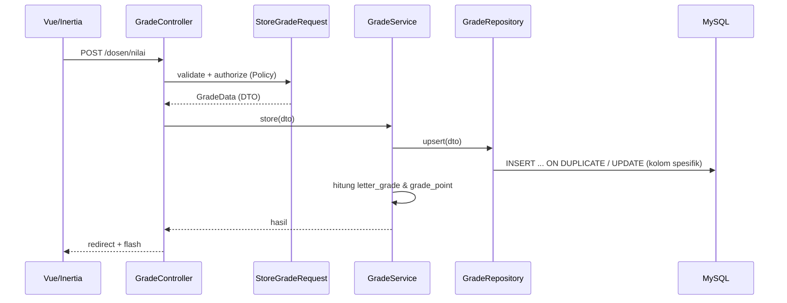

# 02 — CTO / Tech Architect: Arsitektur Sistem

## 1. Diagram Arsitektur

```
┌─────────────────────────────────────────────┐
│                  CLIENT                      │
│  Vue 3 + Inertia.js v3 + Tailwind v4 (CSR)   │
│  Vite 7                                      │
└────────────────────┬────────────────────────┘
                     │ Inertia (XHR)
┌────────────────────┴────────────────────────┐
│                  SERVER (Laravel 13)         │
│  Controller (tipis)                         │
│    ├── FormRequest (validasi + authorize)   │
│    ├── DTO (spatie/laravel-data)            │
│  Service (business logic)                   │
│    ├── Repository (query, no SELECT *)      │
│    └── Model Eloquent                       │
│  Cross-cutting: Fortify · Spatie Permission │
│    · Policies · Middleware · Queue (opsional)│
└────────────────────┬────────────────────────┘
                     │ Eloquent
┌────────────────────┴────────────────────────┐
│              DATABASE (MySQL 8.0+)           │
│  tables + foreign keys + indexes             │
└─────────────────────────────────────────────┘
```

## 2. Alur Request (contoh: dosen input nilai)



## 3. Prinsip Aliran Data

1. **Tidak ada query di Controller/Service** — semua akses DB lewat Repository.
2. **DTO** adalah satu-satunya pembawa data antar layer (bukan array mentah).
3. **Policy** dipanggil di Controller (`$this->authorize()`) untuk otorisasi row-level.
4. **Transaksi** untuk operasi multi-tabel (mis. simpan nilai + hitung ulang IPK).

## 4. Pola Umum per Fitur

Setiap fitur diimplementasikan seragam:

- `app/Enums/<Xxx>Status.php`
- `app/DTO/<Xxx>Data.php`
- `app/Repositories/Contracts/<Xxx>Repository.php`
- `app/Repositories/Eloquent/<Xxx>Repository.php`
- `app/Services/<Xxx>Service.php`
- `app/Http/Controllers/<Xxx>Controller.php`
- `app/Http/Requests/<Xxx>Request.php`
- `app/Policies/<Xxx>Policy.php`
- `resources/js/pages/<role>/<Xxx>.vue`

## 5. Rekomendasi Deploy

- Self-hosted VPS: PHP-FPM + Nginx + MySQL; `php artisan queue:work` bila memakai queue (opsional di v1).
- Env terpisah per lingkungan; `APP_ENV=production`, cache & opcache aktif.
