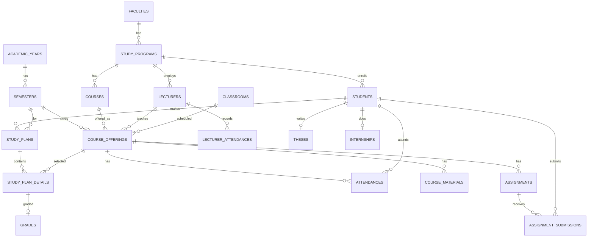

# 03 — CTO / Tech Architect: Skema Database (Lengkap per PRD)

## 1. Diagram Relasi

> Selain tabel di atas, Spatie menambahkan: `roles`, `permissions`, `model_has_roles`, `role_has_permissions`, `model_has_permissions`.

## 2. Spesifikasi Tabel

### Tabel Master

| Tabel | Kolom |
|---|---|
| `users` | id, name, email(unique), password, email_verified_at(null), remember_token, timestamps |
| `faculties` | id, code(unique), name, timestamps, softDeletes |
| `study_programs` | id, faculty_id(fk), code(unique), name, degree_level(string), head_id(fk users null), timestamps, softDeletes |
| `academic_years` | id, code(unique), name, start_date(date), end_date(date), is_active(bool), timestamps |
| `semesters` | id, academic_year_id(fk), type(string: ganjil/genap), start_date, end_date, is_active(bool), timestamps |
| `courses` | id, study_program_id(fk), code(unique), name, sks(tinyint), semester(int), type(string: wajib/pilihan), timestamps, softDeletes |
| `classrooms` | id, code(unique), name, capacity(int), building(string null), timestamps, softDeletes |

### Tabel Mahasiswa & Dosen

| Tabel | Kolom |
|---|---|
| `students` | id, user_id(fk unique), nim(unique), study_program_id(fk), entry_year(string), status(string), gpa(decimal 5,2 default 0), total_sks(int default 0), timestamps |
| `lecturers` | id, user_id(fk unique), nidn(unique), study_program_id(fk null), academic_rank(string), timestamps |

### Tabel Akademik

| Tabel | Kolom |
|---|---|
| `course_offerings` | id, course_id(fk), semester_id(fk), lecturer_id(fk), classroom_id(fk), day(string), start_time(time), end_time(time), quota(int), timestamps |
| `study_plans` (KRS) | id, student_id(fk), semester_id(fk), status(string: draft/submitted/approved/rejected), approved_by(fk users null), approved_at(timestamp null), timestamps |
| `study_plan_details` | id, study_plan_id(fk), course_offering_id(fk), status(string: pending/approved/rejected), timestamps |
| `grades` | id, study_plan_detail_id(fk unique), student_id(fk), course_offering_id(fk), assignment_score(decimal null), midterm_score(decimal null), final_score(decimal null), score(decimal 5,2), letter_grade(string 2), grade_point(decimal 4,2), timestamps |
| `attendances` | id, course_offering_id(fk), student_id(fk), meeting_number(int), date(date), status(string: hadir/izin/sakit/alpha), timestamps |
| `lecturer_attendances` | id, lecturer_id(fk), course_offering_id(fk), date(date), check_in(time null), check_out(time null), status(string), timestamps |

### Tabel Skripsi & KP

| Tabel | Kolom |
|---|---|
| `theses` | id, student_id(fk unique), title, abstract(text), supervisor_1_id(fk lecturers), supervisor_2_id(fk lecturers null), status(string), submission_date(date), timestamps |
| `thesis_logs` | id, thesis_id(fk), date(date), activity, notes(text), supervisor_approval(bool), timestamps |
| `internships` | id, student_id(fk), company_name, address(text), supervisor_id(fk lecturers), field_supervisor(string), start_date(date), end_date(date), status(string), timestamps |
| `internship_logs` | id, internship_id(fk), date(date), activity, notes(text), approval(string: pending/approved/rejected), timestamps |

### Tabel LMS & Pendukung

| Tabel | Kolom |
|---|---|
| `course_materials` | id, course_offering_id(fk), title, description(text null), file_path(string null), uploaded_by(fk users), timestamps |
| `assignments` | id, course_offering_id(fk), title, description(text), due_date(datetime), max_score(decimal), timestamps |
| `assignment_submissions` | id, assignment_id(fk), student_id(fk), file_path, submitted_at(null), score(null), feedback(null), timestamps |
| `announcements` | id, title, content(text), target_role(string null), published_at(null), timestamps |
| `activity_logs` | id, user_id(fk null), action(string), model_type(string), model_id(bigint null), old_values(json null), new_values(json null), timestamps |

## 3. Enums (PHP backed enum)

| Enum | Nilai |
|---|---|
| `DegreeLevel` | d3, d4, s1, s2, s3 |
| `SemesterType` | ganjil, genap |
| `CourseType` | wajib, pilihan |
| `DayOfWeek` | senin, selasa, rabu, kamis, jumat, sabtu, minggu |
| `StudentStatus` | aktif, cuti, lulus, do, nonaktif |
| `AcademicRank` | asisten_ahli, lektor, lektor_kepala, guru_besar |
| `StudyPlanStatus` | draft, submitted, approved, rejected |
| `StudyPlanDetailStatus` | pending, approved, rejected |
| `AttendanceStatus` | hadir, izin, sakit, alpha |
| `LecturerAttendanceStatus` | hadir, terlambat, izin, alpha |
| `ThesisStatus` | proposal, seminar_proposal, sidang, lulus, revisi |
| `InternshipStatus` | draft, berjalan, selesai, ditolak |
| `InternshipLogApproval` | pending, approved, rejected |
| `GradeLetter` | A(4.0), A-(3.75), B+(3.25), B(3.0), B-(2.75), C+(2.25), C(2.0), D(1.0), E(0) |

## 4. Indexes Wajib

- `students.nim`, `students.user_id`, `students.study_program_id`
- `lecturers.nidn`, `lecturers.user_id`
- `courses.code`, `courses.study_program_id`
- `course_offerings(course_id)`, `course_offerings(lecturer_id)`, `course_offerings(semester_id)`
- `study_plans(student_id)`, `study_plans(semester_id)`
- `study_plan_details(study_plan_id)`, `study_plan_details(course_offering_id)`
- `grades(study_plan_detail_id)`, `grades(student_id)`, `grades(course_offering_id)`
- `attendances(course_offering_id, student_id)`, `attendances(student_id, date)`
- `lecturer_attendances(lecturer_id, date)`
- `assignment_submissions(assignment_id, student_id)`
- `theses(supervisor_1_id)`, `theses(supervisor_2_id)`

## 5. Aturan

- PK `$table->id()`; FK `$table->foreignId()->constrained()->cascadeOnDelete()` (relasi opsional `nullOnDelete()`).
- Status/tipe disimpan sebagai **string** (nilai divalidasi via enum PHP), bukan `enum()` DB, agar portable.
- Tabel master (`faculties`, `study_programs`, `courses`, `classrooms`) pakai `softDeletes()`.
- Semua tabel `$table->timestamps()`.
