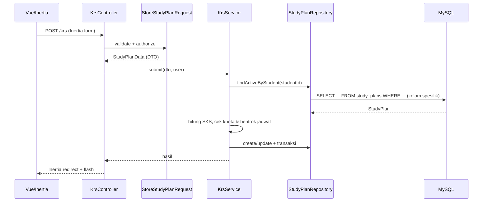
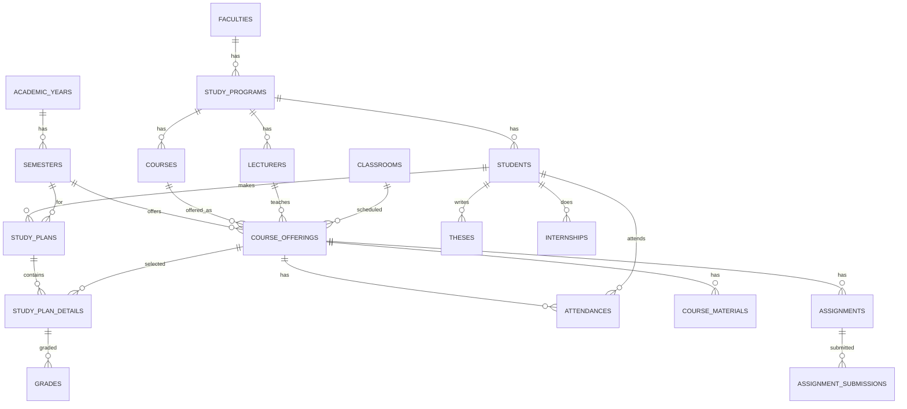

# PLAN — Rencana Implementasi SIAKAD

> **Versi:** 1.0 · **Tanggal:** 21 September 2026
> **Stack final:** Laravel 13 (PHP 8.3+) · Inertia.js v3 · Vue 3 (Composition API) · Tailwind CSS v4 · MySQL 8.0+ · Fortify · Spatie Permission · Pest

---

## 1. Arsitektur Sistem

### 1.1 Diagram Arsitektur

```
┌─────────────────────────────────────────────────┐
│                    CLIENT                        │
│  Vue 3 (Composition API) + Inertia.js v3         │
│  Tailwind CSS v4 (komponen Vue ringan)           │
│  Vite 7 (CSR, SSR opsional saat development)     │
└──────────────────────┬──────────────────────────┘
                       │ Inertia (XHR / SSR)
┌──────────────────────┴──────────────────────────┐
│                    SERVER                        │
│  Laravel 13 (PHP 8.3+)                           │
│  ┌───────────────────────────────────────────┐   │
│  │ HTTP Layer: Controller + FormRequest       │   │
│  │   (validasi → DTO)                        │   │
│  ├───────────────────────────────────────────┤   │
│  │ Service Layer: Business Logic              │   │
│  │   (KrsService, GradeService, dsb.)        │   │
│  ├───────────────────────────────────────────┤   │
│  │ Repository Layer: Data Access              │   │
│  │   (interface + Eloquent impl, no SELECT *) │   │
│  ├───────────────────────────────────────────┤   │
│  │ Cross-cutting:                              │   │
│  │  ├── Fortify (Auth)                        │   │
│  │  ├── Spatie Permission (RBAC)              │   │
│  │  ├── Laravel AI SDK (AI Advisor)           │   │
│  │  ├── Policies (row-level authorization)    │   │
│  │  └── Queue, Cache (Redis), Middleware      │   │
│  └───────────────────────────────────────────┘   │
└──────────────────────┬──────────────────────────┘
                       │ Eloquent (pdo_mysql)
┌──────────────────────┴──────────────────────────┐
│                  DATABASE                        │
│  MySQL 8.0+ / PostgreSQL 16+                     │
│  (foreign keys + indexes untuk performa)         │
└─────────────────────────────────────────────────┘
```

### 1.2 Penjelasan Layer

| Layer | Tanggung Jawab | Aturan |
|---|---|---|
| **Controller** | Menerima HTTP request, memanggil FormRequest, meneruskan DTO ke Service, mengembalikan Inertia response / redirect. | Tipis, tanpa business logic. |
| **FormRequest** | Validasi input & authorization (`authorize()`). | Tidak mengakses DB untuk logika bisnis. |
| **DTO** (`spatie/laravel-data`) | Kontrak data antar layer; validasi payload terpusat. | Data berpindah sebagai DTO, bukan array mentah. |
| **Service** | Business logic, orkestrasi antar repository, transaksi DB, event, cache invalidation. | Stateless; memanggil repository, tidak menulis query langsung. |
| **Repository** | Akses data via Eloquent; enkapsulasi query. | **Dilarang `SELECT *`** — wajib `->select([...])`; eager-load kolom spesifik. |
| **Model** | Mapping tabel, relasi, casts, enum, scope kecil. | Relasi didefinisikan di sini; query kompleks di repository. |
| **Policy** | Otorisasi row-level (mis. dosen hanya akses kelasnya). | Dipanggil via `$this->authorize()` / `Gate`. |

### 1.3 Alur Request Contoh (Submit KRS)



---

## 2. Struktur Database (ERD)

### 2.1 Diagram Relasi (ringkas)



### 2.2 Detail Tabel & Kolom

#### Tabel Master

**`users`** — akun autentikasi (Fortify)
| Kolom | Tipe | Ket. |
|---|---|---|
| id | bigint PK | |
| name | string | |
| email | string unique | |
| password | string | hashed |
| email_verified_at | timestamp null | |
| remember_token | string null | |
| timestamps | | |

> Role & identitas akademik **tidak** disimpan di `users`, melainkan di `students`/`lecturers` + `model_has_roles` (Spatie).

**`faculties`**
| Kolom | Tipe |
|---|---|
| id, code (unique), name, dean_id (fk users nullable), timestamps, deleted_at (softDeletes) | |

**`study_programs`**
| Kolom | Tipe |
|---|---|
| id, faculty_id (fk), code (unique), name, degree_level (enum: D3/D4/S1/S2/S3), head_id (fk users nullable), timestamps, deleted_at | |

**`academic_years`**
| Kolom | Tipe |
|---|---|
| id, code (unique, e.g. "2025/2026"), name, start_date, end_date, is_active (bool), timestamps | |

**`semesters`**
| Kolom | Tipe |
|---|---|
| id, academic_year_id (fk), type (enum: ganjil/genap), start_date, end_date, is_active (bool), timestamps | |

**`courses`**
| Kolom | Tipe |
|---|---|
| id, study_program_id (fk), code (unique), name, sks (tinyint), semester (int), type (enum: wajib/pilihan), timestamps, deleted_at | |

**`classrooms`**
| Kolom | Tipe |
|---|---|
| id, code (unique), name, capacity (int), building (string null), timestamps, deleted_at | |

#### Tabel Mahasiswa & Dosen

**`students`**
| Kolom | Tipe |
|---|---|
| id, user_id (fk unique), nim (unique), study_program_id (fk), entry_year (string/int), status (enum: aktif/cuti/lulus/do/nonaktif), gpa (decimal 5,2 default 0), total_sks (int default 0), timestamps | |

**`lecturers`**
| Kolom | Tipe |
|---|---|
| id, user_id (fk unique), nidn (unique), study_program_id (fk nullable), academic_rank (enum: asisten_ahli/lektor/lektor_kepala/guru_besar), timestamps | |

#### Tabel Akademik

**`course_offerings`** (kelas yang dibuka per semester)
| Kolom | Tipe |
|---|---|
| id, course_id (fk), semester_id (fk), lecturer_id (fk), classroom_id (fk), day (enum: senin..minggu), start_time (time), end_time (time), quota (int), timestamps | |

**`study_plans`** (KRS)
| Kolom | Tipe |
|---|---|
| id, student_id (fk), semester_id (fk), status (enum: draft/submitted/approved/rejected), approved_by (fk users nullable), approved_at (timestamp null), timestamps | |

**`study_plan_details`**
| Kolom | Tipe |
|---|---|
| id, study_plan_id (fk), course_offering_id (fk), status (enum: pending/approved/rejected), timestamps | |

**`grades`**
| Kolom | Tipe |
|---|---|
| id, study_plan_detail_id (fk unique), student_id (fk), course_offering_id (fk), assignment_score (decimal null), midterm_score (decimal null), final_score (decimal null), score (decimal), letter_grade (string 2), grade_point (decimal 5,2), timestamps | |

**`attendances`** (presensi mahasiswa)
| Kolom | Tipe |
|---|---|
| id, course_offering_id (fk), student_id (fk), meeting_number (int), date (date), status (enum: hadir/izin/sakit/alpha), timestamps | |

**`lecturer_attendances`** (presensi dosen)
| Kolom | Tipe |
|---|---|
| id, lecturer_id (fk), course_offering_id (fk), date (date), check_in (time null), check_out (time null), status (enum: hadir/terlambat/izin/alpha), timestamps | |

#### Tabel Skripsi & KP

**`theses`**
| Kolom | Tipe |
|---|---|
| id, student_id (fk unique), title, abstract (text), supervisor_1_id (fk lecturers), supervisor_2_id (fk lecturers nullable), status (enum: proposal/seminar_proposal/sidang/lulus/revisi), submission_date (date), timestamps | |

**`thesis_logs`**
| Kolom | Tipe |
|---|---|
| id, thesis_id (fk), date (date), activity, notes (text), supervisor_approval (bool), timestamps | |

**`internships`**
| Kolom | Tipe |
|---|---|
| id, student_id (fk), company_name, address (text), supervisor_id (fk lecturers), field_supervisor (string), start_date, end_date, status (enum: draft/berjalan/selesai/ditolak), timestamps | |

**`internship_logs`**
| Kolom | Tipe |
|---|---|
| id, internship_id (fk), date (date), activity, notes (text), approval (enum: pending/approved/rejected), timestamps | |

#### Tabel LMS

**`course_materials`**
| Kolom | Tipe |
|---|---|
| id, course_offering_id (fk), title, description (text null), file_path (string null), uploaded_by (fk users), timestamps | |

**`assignments`**
| Kolom | Tipe |
|---|---|
| id, course_offering_id (fk), title, description (text), due_date (datetime), max_score (decimal), timestamps | |

**`assignment_submissions`**
| Kolom | Tipe |
|---|---|
| id, assignment_id (fk), student_id (fk), file_path, submitted_at (timestamp null), score (decimal null), feedback (text null), timestamps | |

#### Tabel Pendukung

**`announcements`**
| Kolom | Tipe |
|---|---|
| id, title, content (text), target_role (string null), published_at (timestamp null), timestamps | |

**`activity_logs`**
| Kolom | Tipe |
|---|---|
| id, user_id (fk nullable), action (string), model_type (string), model_id (bigint nullable), old_values (json null), new_values (json null), timestamps | |

### 2.3 Strategi Index & Enum

- **Index wajib** (selain FK yang otomatis ter-index via `constrained()`): `students.nim`, `students.user_id`, `lecturers.nidn`, `courses.code`, `course_offerings(semester_id, course_id)`, `study_plan_details(study_plan_id)`, `grades(student_id, course_offering_id)`, `attendances(course_offering_id, student_id)`, `attendances(student_id, date)`.
- **Enum** direpresentasikan sebagai **PHP backed enum** + kolom `string` (bukan `->enum()` DB) agar portable (MySQL & PostgreSQL), mudah di-refactor, dan tidak perlu `ALTER TABLE` saat menambah nilai. Validasi nilai enum dilakukan di FormRequest/DTO.

---

## 3. Struktur Halaman (Frontend)

> Frontend: Vue 3 (Composition API, `<script setup>`), Inertia v3, Tailwind v4. Komponen UI dibuat ringan di `resources/js/components/ui/` (Button, Card, Table, Modal/Dialog, Select, Input, Badge, Tabs, Toast, Skeleton, Dropdown) — menggantikan shadcn/ui agar lebih ringan.

### 3.1 Auth

| Route | Halaman | Komponen |
|---|---|---|
| `/login` | Login | Card, Input, Button |
| `/register` | Register | Card, Input, Button |
| `/forgot-password` | Lupa password | Card, Input, Button |
| `/reset-password` | Reset password | Card, Input, Button |
| `/verify-email` | Verifikasi email | Card, Alert |

### 3.2 Dashboard per Role

| Role | Isi |
|---|---|
| Mahasiswa | Stat cards (SKS ditempuh, IPK, persentase kehadiran), chart IPS per semester, jadwal hari ini, pengumuman |
| Dosen | Stat cards (kelas diampu, jumlah bimbingan), jadwal mengajar hari ini, daftar tugas yang perlu dinilai |
| Admin | Stat cards (total mahasiswa/dosen/prodi), chart tren pendaftaran, aktivitas terbaru |
| Pimpinan | Stat cards ringkasan, chart agregat, tautan laporan |

### 3.3 Halaman Mahasiswa

| Route | Halaman | Komponen utama |
|---|---|---|
| `/krs` | KRS Online | Card info SKS, Table daftar MK, checkbox pilih, Dialog konfirmasi, Badge status |
| `/khs` | KHS | Tabs per semester, Table nilai |
| `/transkrip` | Transkrip | Table + Button export PDF |
| `/presensi` | Riwayat presensi | Table + Progress bar persentase |
| `/jadwal` | Jadwal mingguan | Table/agenda |
| `/lms` | Daftar MK → materi & tugas | List, Card materi, Table tugas |
| `/skripsi` | Skripsi tracking | Card status, Timeline log bimbingan |
| `/kp` | Kerja praktek | Form, logbook list |
| `/ai-advisor` | Chat AI | Chat bubble, input, loading indicator |

### 3.4 Halaman Dosen

| Route | Halaman | Komponen utama |
|---|---|---|
| `/nilai` | Input nilai | Select kelas, Table editable (nilai tugas/UTS/UAS + auto final & grade), Button simpan/export |
| `/presensi-kelas` | Presensi kelas | Pilih kelas & pertemuan, Table presensi (radio hadir/izin/sakit/alpha) |
| `/bimbingan-pa` | Bimbingan PA | Table KRS bimbingan, Dialog approve/reject |
| `/bimbingan-skripsi` | Bimbingan skripsi | List mahasiswa, form update status & log |
| `/lms-management` | Kelola LMS | Form upload materi, CRUD tugas, Table submission |

### 3.5 Halaman Admin & Pimpinan

| Route | Halaman |
|---|---|
| `/master/fakultas`, `/master/prodi`, `/master/mata-kuliah`, `/master/kelas`, `/master/ruangan`, `/master/periode-akademik` | CRUD master data (Table + Modal form) |
| `/users` | User management (dosen & mahasiswa) |
| `/krs-approval` | Monitoring KRS |
| `/skripsi-kp` | Assign pembimbing |
| `/kehadiran-dosen` | Monitoring kehadiran dosen |
| `/announcements` | Kelola pengumuman |
| `/laporan` (pimpinan) | Laporan akademik |

---

## 4. Library & Package

### 4.1 Backend (Composer)

```json
{
  "laravel/framework": "^13.0",
  "laravel/fortify": "^1.25",
  "spatie/laravel-permission": "^6.0",
  "spatie/laravel-data": "^4.0",
  "inertiajs/inertia-laravel": "^3.0",
  "laravel/ai": "^1.0",
  "laravel/sanctum": "^4.0",
  "barryvdh/laravel-dompdf": "^3.0",
  "maatwebsite/excel": "^3.1"
}
```

> `laravel/ai` adalah SDK AI first-party (text generation, embeddings, tool calling). `barryvdh/laravel-dompdf` & `maatwebsite/excel` untuk ekspor PDF/Excel. Dev: `pestphp/pest`, `laravel/pint`, `larastan/larastan` (opsional).

### 4.2 Frontend (NPM)

```json
{
  "@inertiajs/vue3": "^3.0",
  "vue": "^3.5",
  "@vitejs/plugin-vue": "^5.0",
  "tailwindcss": "^4.0",
  "@tailwindcss/vite": "^4.0",
  "recharts-vue": "latest",
  "ziggy-js": "latest"
}
```

> Tidak memakai TypeScript & shadcn/ui agar ringan. Grafik memakai recharts (vue wrapper) atau chart buatan ringan; tabel pakai komponen Vue custom (tanpa TanStack untuk mengurangi bundle).

---

## 5. Arsitektur Kode (Service–Repository–DTO)

### 5.1 Struktur Folder `app/`

```
app/
├── Enums/                       # PHP backed enums (status, grade, day, dll.)
├── Models/
├── DTO/                         # DTO via spatie/laravel-data
├── Http/
│   ├── Controllers/
│   ├── Middleware/
│   └── Requests/                # FormRequest (validasi + authorize)
├── Services/                    # business logic
├── Repositories/
│   ├── Contracts/               # interface
│   └── Eloquent/                # implementasi
├── Policies/
└── Support/                     # helper, grade calculator, dll.
```

### 5.2 Contoh Kontrak

**Interface repository** (`app/Repositories/Contracts/GradeRepository.php`):
```php
interface GradeRepository
{
    public function findByOffering(int $offeringId): Collection;   // select kolom spesifik
    public function upsert(array $rows): void;
    public function getByStudent(int $studentId): Collection;
}
```

**Implementasi** (`app/Repositories/Eloquent/GradeRepository.php`) — **tanpa `SELECT *`**:
```php
class GradeRepository implements GradeRepository
{
    public function findByOffering(int $offeringId): Collection
    {
        return Grade::query()
            ->select(['id', 'student_id', 'course_offering_id',
                      'assignment_score', 'midterm_score', 'final_score',
                      'score', 'letter_grade', 'grade_point'])
            ->with(['student:id,user_id,nim', 'student.user:id,name'])
            ->where('course_offering_id', $offeringId)
            ->get();
    }
}
```

**Service** (`app/Services/GradeService.php`):
```php
class GradeService
{
    public function __construct(
        private readonly GradeRepository $grades,
        private readonly StudentRepository $students,
    ) {}

    public function store(GradeData $data): void
    {
        DB::transaction(function () use ($data) {
            $final = GradeCalculator::final($data->assignment, $data->midterm, $data->final);
            $this->grades->upsert([...]);
            $this->students->recalculateGpa($data->studentId);
        });
    }
}
```

### 5.3 Aturan Wajib (untuk semua fitur)

1. **Dilarang `SELECT *`** dan dilarang `Model::all()` tanpa `->select()`. Selalu daftar kolom yang diperlukan.
2. **Eager-load dengan kolom spesifik**: `with('student:id,nim,user_id')` — jangan lazy-load.
3. **DTO** sebagai input/output service (`spatie/laravel-data`); controller menerima DTO dari FormRequest.
4. **Otorisasi** ganda: middleware permission (role) + Policy (row-level) di controller/service.
5. **Transaksi DB** untuk operasi multi-tabel (simpan KRS, batch nilai, approval).

---

## 6. Urutan Implementasi & Timeline

Total estimasi: **10 minggu** (1 developer full-time, atau 2 developer paralel).

### Fase 1 — Fondasi (Minggu 1–2)
1. Setup Laravel 13 + Inertia v3 + Vue 3 + Tailwind v4 + Vite 7.
2. Setup komponen UI dasar (Button, Card, Table, Modal, Input, Select, Badge, Tabs, Toast, Skeleton, Dropdown).
3. Setup Fortify (auth) + Spatie Permission (roles & permissions).
4. Migrasi seluruh tabel + PHP enums.
5. Model Eloquent + relasi lengkap.
6. Seeder data dummy (fakultas, prodi, MK, user, mahasiswa, dosen, periode).

**Keluaran:** aplikasi bisa login, RBAC aktif, DB lengkap, layout dasar.

### Fase 2 — Auth & Layout (Minggu 2–3)
1. Halaman Login, Register, Forgot/Reset Password (Fortify + Inertia).
2. Layout utama (sidebar, header, breadcrumbs via Ziggy).
3. Middleware & routing per role.
4. Dashboard per role (stat cards, chart dasar, aktivitas).

### Fase 3 — Fitur Mahasiswa (Minggu 3–5)
1. KRS Online (form pilih MK, validasi SKS & bentrok jadwal, submit).
2. KHS & Transkrip (perhitungan IPK/IPS, export PDF).
3. Presensi & Jadwal.
4. LMS (materi, tugas, submission).
5. Skripsi & KP tracking.
6. AI Academic Advisor (Laravel AI SDK + semantic search).

### Fase 4 — Fitur Dosen (Minggu 5–7)
1. Input Nilai (tabel editable, auto final & grade, batch save).
2. Presensi Kelas.
3. Bimbingan PA & Skripsi.
4. LMS Management.

### Fase 5 — Fitur Admin (Minggu 7–9)
1. Master Data CRUD.
2. User Management.
3. KRS Approval monitoring.
4. Skripsi & KP management.
5. Monitoring kehadiran dosen.
6. Announcements.
7. Laporan pimpinan.

### Fase 6 — Testing & Polish (Minggu 9–10)
1. Feature test & unit test (Pest) untuk seluruh service & alur.
2. Optimasi query (audit N+1 & `SELECT *`), caching.
3. Security audit (headers, rate limiting, policies).
4. Responsive testing.
5. Deployment preparation (Envoy/Forge, queue worker, scheduler).

---

## 7. Keamanan & Performa (Ringkasan Implementasi)

| Area | Implementasi |
|---|---|
| RBAC | Spatie Permission; roles: `admin`, `admin_fakultas`, `dosen`, `mahasiswa`, `pimpinan` |
| Faculty-scoping | Repository menerima scope fakultas via middleware/context; admin fakultas otomatis ter-filter |
| Row-level auth | Policies (`GradePolicy`, `StudyPlanPolicy`, `ThesisPolicy`, `CourseOfferingPolicy`) |
| Rate limiting | `RateLimiter` pada login, reset password, submit KRS, input nilai, chat AI |
| Headers | Middleware keamanan global (`SecureHeaders`) |
| Caching | Redis untuk master data & dashboard; invalidasi via event/observer |
| Anti N+1 | Eager-load kolom spesifik; Laravel Debugbar/Pulse untuk profiling |
| Queue | Export PDF/Excel, embedding dokumen, notifikasi |
